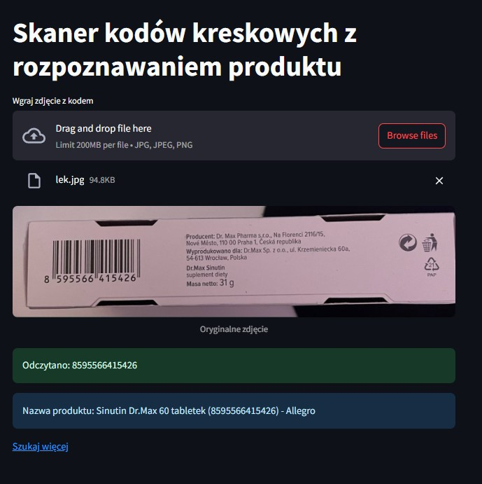

# Skaner kodów kreskowych zaprezentowany za pomocą Streamlit

Prosty projekt zrobiony w pythonie, który ma odczytywać kod kreskowy ze zdjęcia i automatycznie wyszukiwać nazwę produktu w internecie.

## Funkcje
- Wczytywanie zdjęcia z kodem (JPG/PNG)
- Dekodowanie kodu kreskowego (EAN/UPC/QR)
- Automatyczne wyszukiwanie produktu w DuckDuckGo
- Podgląd zdjęcia z oznaczeniem kodu
- Plik 'requirements.txt' z bibliotekami

## Jak uruchomić plik lokalnie
Aplikacja:
1. Pobrać pliki/folder
2. Zainstalować biblioteki np. w bashu: pip install -r requirements.txt
3. Uruchomić aplikację: steamlit run aplkiacja.py
4. Wstawić wyraźne zdjęcie produktu z kodem oraz w odpowiednim formacie

Można też uruchomić np. w Pycharm'ie plik skaner.py, trzeba wpisać w nazwie pliku zdjęcie, które ma być użyte
np. nazwa_pliku = "woda_jablkowa.jpg", a następnie kliknąć run.
W pliku domyślnie są zakomentowane przykładowe opcje zdjęć załączonych :D

### Zawartość
Są dwa pliki skaner.py oraz aplikacja.py
- skaner.py: działa lokalnie np. w pycharmie i pobiera zdjęcie z folderu
- aplikacja.py: odpalane jest w Streamlit i tam importuje się dane zdjęcie

Przykładowe zdjęcia randomowych produktów, które miałam pod ręką :)
- lek.jpg
- mus_owocowy.jpg
- pigwoniada.jpg
- woda_jablkowa.jpg

Oczywiście można użyć jakiś swoich zdjęć lub dowolnych z internetu. Trzeba pamiętać, żeby było wyraźne, najlepiej bez odbijającego się światła, na w miarę płaskiej powierzchni oraz oczywiście ma być widoczne - obojętnie czy kod jest pionowo lub poziomo, obie opcje odczytuje.

Projekt stworzony przez oclau – 2025
Na potrzeby nauki Pythona 